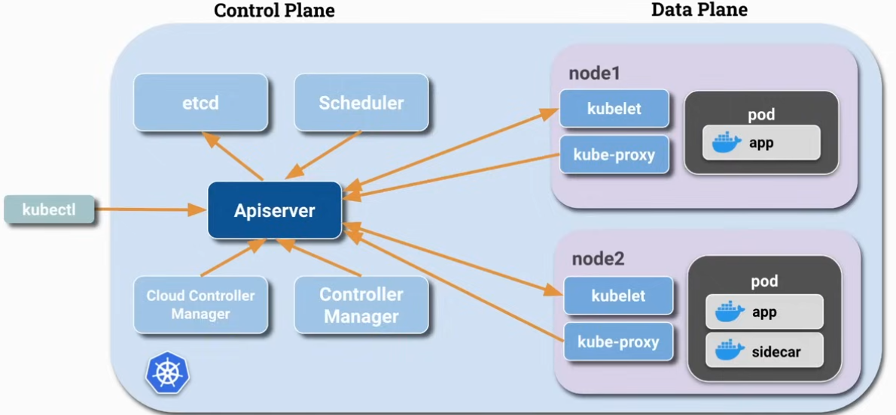
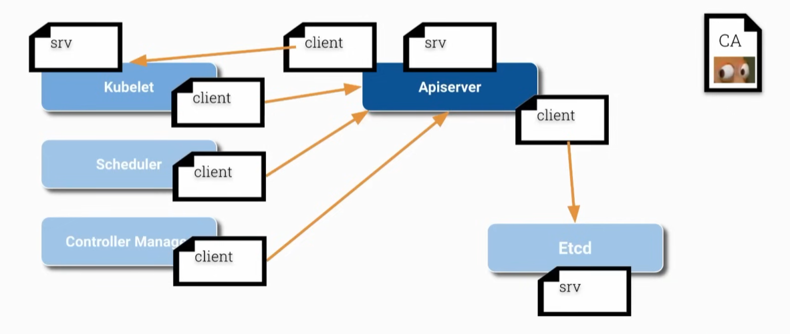
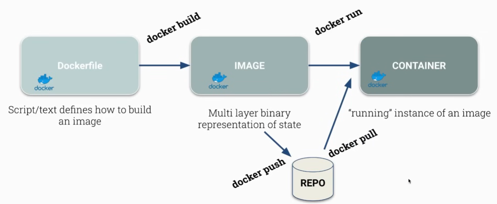
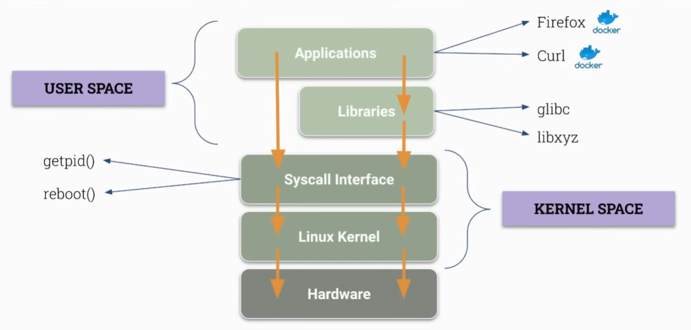
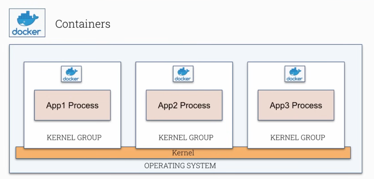
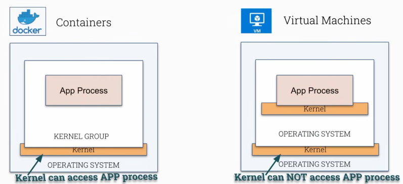

# Foundational Kubernetes Concepts

## Kubernetes Architecture

We have containers and container information which we throw at kubernetes and it will:

- Run our container in **container engine**
- Schedule containers efficiently
- Keep containers alive and healthy
- Allow container communication
- Allow common deployment techniques
- Handle volumes

> [!Note]
> Using `kubectl`, we communicate with **Kubernetes API server**, as it is the central part of Kubernetes which makes it greatly extensible and reusable.

### How does Kubernetes work with nodes?

Also how does the API server work with nodes and communicate with nodes?

It does that with `kubelet`, which converts an instance (virtual machine) into a kubernetes node, which can actually run.

#### kubelet

- It can run pods
- Gets the information of what pods to run from the API server
- It can also communicate with API server

Here we have two way communication between API server and kubelet

#### Scheduler

It decides which node will run which pod, and and communicate that information to the API server.

### etcd (Database of Kubernetes)

It a key-value store and it holds the complete state of the cluster. We can backup our whole state and can also be restored from backup.

### Controller Manager

It contains various sub-components and it has various control loops which checks various resources e.g., Deployments or ReplicaSets. The control loop keeps all the resources alive.

### Cloud Controller Manager

It is the cloud specific controller.

### kube-proxy

It communicates with the API server and it receive updates about Services created in Kubernetes.

Services allows for easy communication between pods. Services are represented in the kube-proxy component. Kubernetes service is mostly IP table rules which are implemented on every nodes.

So whenever we create a new service or update a service in Kubernetes, all kube-proxies on every node implement this changes by creating or updating IP table rules on each node.

> [!Note]
> A pod can run multiple containers, such as **sidecar** alongside the main application container. Sidecar containers share the same network and storage namespaces as the main container, enabling efficient communication and resource sharing.



## Pod to Pod communication

Pod to Pod communication in Kubernetes is managed by **CNI** *(Container Network Interface)*. There are various CNI Plugins which implement that interface, which actually create and manage the network infrastructure and manages pod to pod communication.

> [!Note]
> By default, every pod can communicate with every pod. And this can happen without Network Address Translation (NAT). Each pod is assigned a unique cluster-private IP address, and these IP addresses are routable across the cluster, allowing direct communication between pods regardless of the node they reside on.

---

## Public Key Infrastructure (PKI) – Certificate Authority (CA)

- CA is the trusted root of all certificates inside the cluster
- All cluster certificates are signed by the CA
- Used by components to validate each other.

**Example of CA**:

- API Server Certificate
- Kubelet Certificate (server & client cert)
- Scheduler Certificate



## Find Certificates – HANDS ON

1. CA
2. API server cert
3. etcd server cert
4. API → etcd
5. API → kubelet
6. Scheduler → API
7. Controller Manager → API
8. kubelet → API
9. kubelet server cert

```bash
cd /etc/kubernetes/pki/
ll

cd etcd/
ll

vim /etc/kubernetes/scheduler.conf
# Scroll down and see client-certificate for Scheduler → API

vim /etc/kubernetes/controller-manager.conf
# Scroll down and see client-certificate for Controller Manager → API

vim /etc/kubernetes/controller-manager.conf
# Scroll down and see client-certificate for Controller Manager → API

# See the kubelet client & server certificate on both the Master & Worker node
vim /etc/kubernetes/kubelet.conf
ll /var/lib/kubelet/pki/
```

---

## Containers Under the Hood



### Container

- Collection of one or multiple applications
- Includes all its dependencies
- Just a process which runs on the Linux Kernel
  - but which cannot see everything

### Kernel Space vs User Space



- Kernel Space includes the **Linux Kernel** and **Syscall Interface**.
- Libraries and Application runs in User Space.
- Syscall Interface helps user to communicate with Linux Kernel. And our applications can call Syscall Interface directly or go through libraries which uses Syscall Interface to interact with Linux Kernel.

### Container with Kernel



In the security perspective, if all these containers run on same Linux Kernel and can perform Syscall to the Linux Kernel then these all could also exploit some Linux Kernel bugs.

Thus it could be that there's not a too strong isolation between App1 process and App2 process, if there is some exploitable security issue in the Kernel.

### Container vs Virtual Machine



### Linux Kernel Namespaces

> Namespaces isolate processes

In Linux, namespaces are a feature that **partitions kernel resources**, so processes only see resources within their namespace. There are several types:

1. **PID Namespace**
    - Isolates process IDs from each other
    - One process cannot see other
    - Processes in different namespaces can have the same PID

2. **Mount**
    - Restrict access to mounts or root filesystem

3. **Network**
    - Only access certain network devices
    - Firewall & routing rules & socket port numbers
    - Not able to see all traffic or contact all endpoints

4. **User**
    - Different set of user ids used
    - User (0) inside one namespace can be different from user (0) inside another
    - Don't use the host-root-user (0) inside a container

### Container Isolation

- **Namespaces**: Restrict what processes can see
  - Other processes
  - Users
  - Filesystem

- **cgroup**: Restrict the resource usage of processes
  - RAM
  - Disk
  - CPU

---

## Container Tools – HANDS ON

We will have a look the followings:

- **Docker**: Container Runtime + Tool for managing containers & images
- **Containerd**: Container Runtime
- **Crictl**: CLI for CRI-compatible Container Runtime
- **Podman**: Tool for managing containers and images

> [!Note]
> We are going to use `podman` CLI instead of `docker`

### Example use of `podman`

```bash
podman --version

vim Dockerfil
podman build -t simple:v1 .

podman images | grep simple
podman run myapp:v1

podman ps -a

podman build -t simple:v2 . --no-cache
```

### Use of `crictl`

```bash
crictl ps
# containers running in kubernetes control-plane

cat /etc/crictl.yaml
# configured to communicate with containerd
```
