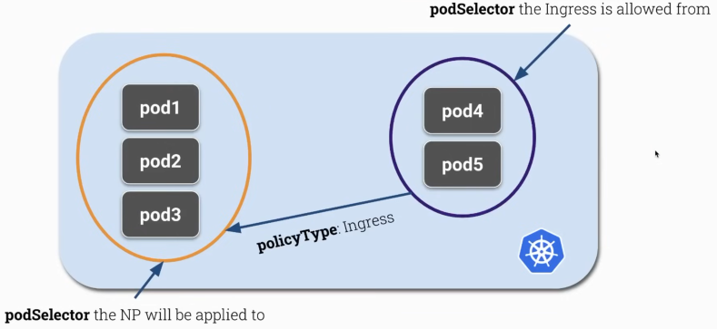
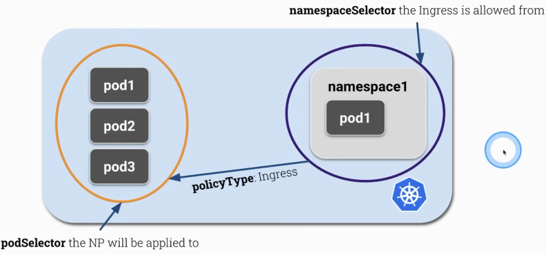
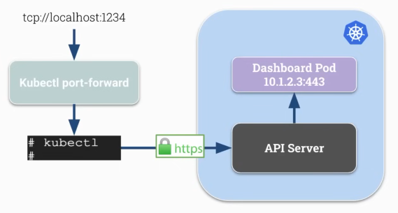

# Kubernetes Security Specialist (CKS) – Study Guide

A comprehensive study guide and practical resource for the **Certified Kubernetes Security Specialist (CKS)** exam. This repository covers essential K8s security concepts, best practices, and hands-on labs to help you master Kubernetes security fundamentals and pass the CKS certification.

## K8s Security Best Practices

- Security combines many different complex processes
- Environments change e.g., security cannot stay in a certain state
- Attackers have advantage
  - They decide time
  - They pick what to attack like weakest link

### Security Principles

1. Defense in Depth
2. Least Privilege
3. Limiting the Attack Surface

> [!Note]
> **Redundancy** is good... in security. In case of application development, follow **DRY** ("Don't repeat yourself"), but in security consider Layered defense and Redundancy.

### Kubernetes Security Categories

1. Host Operating System Security 🐧
2. Kubernetes Cluster Security ☸️
    - It's already done in Managed K8s Service e.g., by AWS or Google
3. Application Security 🐳

#### Host OS Security

- Kubernetes Nodes should only do one thing Kubernetes
- Reduce Attack Surface
  - Remove unncessary applications
  - Keep up to date
- Runtime Security Tools
- Find and identify malicious processes
- Restrict IAM / SSH access

#### Kubernetes Cluster Security

- Kubernetes components are running secure and up-to date:
  - API Server
  - kubelet
  - ETCD
- Restrict (external) access
- Use Authentication → Authorization
- AdmissionControllers
  - NodeRestriction
  - Custom Policies (OPA)
- Enable Audit Logging
- Security Benchmarking
- Encrypt Traffic to ETCD

#### Application Security

- Use Secrets / no hardcoded credentials
- RBAC
- Container Sandboxing
- Container Hardening
  - Attack Surface
  - Run as user
  - Readonly filesystem
- Vulnerability Scanning
- mTLS / ServiceMeshes

---

## Container Isolation in action

> [!Note]
> You must be familiar with Kubernetes architecture and basic components. For basic introduction, you can should check out [Foundation.md](./Foundation.md)

### Create two containers and check if they can see each other

```bash
podman run --name c1 -d ubuntu sh -c 'sleep 1d'
podman exec c1 ps aux

podman run --name c2 -d ubuntu sh -c 'sleep 999d'
podman exec c2 ps aux

ps aux | grep sleep
```

Then create two container in the same namespace

```bash
podman rm c2 --force

# Run the c2 in the PID namespace as c1
podman run --name c2 --pid=container:c1 -d ubuntu sh -c 'sleep 999d'

podman exec c2 ps aux
podman exec c1 ps aux
```

---

## Network Policies

- Firewall Rules in Kubernetes
- Implemented by the **Network Plugins CNI** (Calico / Weave)
- Namespace level
- Restrict the ingress and/or Egress for a group of Pods based on certain rules and conditions

### Without NetworkPolicies

- By default every pod can access every pod
- Pods are NOT isolated

### Example Visualization of NetworkPolicies






### Example of `yaml` Declarative Configurations of NetworkPolicy

```yaml
kind: NetworkPolicy
metadata:
  name: example
  namespace: default
spec:
  podSelector:
    matchLabels:
      id: frontend
  policyTypes:
  - Egress
```

The above example is a valid Network policy which:

- **denies** all outgoing traffic
- from pods with label id=frontend
- in namespace default

```yaml
kind: NetworkPolicy
metadata:
  name: example
  namespace: default
spec:
  podSelector:
    matchLabels:
      id: frontend  # will be applied to these pods
  policyTypes:
  - Egress  # will be about outgoing traffic
  egress:
  - to:
  # allow outgoing traffic to namespace with label id=ns1 AND port 80
    - namespaceSelector:
        matchLabels:
          id: ns1
    ports:
    - protocol: TCP
      port: 80
  - to:
  # allow outgoing traffic to pods with label id=backend in same namespace (default)
    - podSelector:
        matchLabels:
          id: backend
```

In the above example two egress rules are connected with "OR".

### Multiple NetworkPolicies

- Possible to have multiple NPs selecting the same pods
- If a pod has more than one NP
  - then the union of all NPs is applied
  - order doesn't affect policy result

You can check out the [`example.yaml`](./NetworkPolicy/merged-policy/example.yaml) which is being a merged-policy of [`example2a.yaml`](./NetworkPolicy/merged-policy/example2a.yaml) and [`example2b.yaml`](./NetworkPolicy/merged-policy/example2b.yaml)

### Default Deny NetworkPolicy

We'll create a very simple scenario with one frontend pod and one backend pod, and we'll check the connectivity between each pod before and after of creating our NetworkPolicy.

```bash
kubectl run frontend --image=nginx:alpine
kubectl run backend --image=nginx:alpine

kubectl expose pod frontend --port 80
kubectl expose pod backend --port 80

kubectl get pod,svc

# Now check connectivity from frontend to backend, & vice versa
kubectl exec frontend -- curl backend
kubectl exec backend -- curl frontend

# Now we'll create our network policy
vim default-deny.yaml
kubectl -f default-deny.yaml create

kubectl exec frontend -- curl backend
kubectl exec backend -- curl frontend
```

Use the example [`default-deny.yaml`](./NetworkPolicy/default-deny/default-deny.yaml) for practice.

### Allow frontend pods to talk to backend pods

-- based on `podSelectors`

We will specifically allow frontend pod to connect to backend pod e.g., we'll create one network policy to allow outgoing traffic from frontend and one incoming traffic from frontend to backend.

```bash
vim frontend.yaml
kubectl -f frontend.yaml create

kubectl exec frontend -- curl backend

vim backend.yaml
kubectl -f backend.yaml create

kubectl exec frontend -- curl backend
# It will still not work
```

> [!Important]
> Our **default-deny policy** even denies default DNS traffic (port 53), as we need DNS resolution for frontend to connect with backend.

```bash
kubectl get pod --show-labels -owide
kubectl exec frontend -- curl <backend-IP>
```

> [!Note]
> If you would like to allow DNS resolution, you have to extend your default-deny policy where you would allow Egress to the port 53.
>
> You can check out [`allow-dns-resolution.yaml`](./NetworkPolicy/default-deny/allow-dns-resolution.yaml)

### Allow backend pods to talk to database pods

-- based on `namespaceSelectors`

#### pod-frontend → pod-backend → pod-cassandra

```bash
kubectl create ns cassandra

# Add "ns: cassandra" labels
kubectl edit ns cassandra
# OR
kubectl label namespace cassandra ns=cassandra

kubectl -n cassandra run cassandra --image=nginx:alpine
kubectl -n cassandra get pod -owide

kubectl exec backend -- curl <cassandra-IP>
```

Now we'll allow backend pods to have egress traffic the namespace `cassandra`, where our database pod is running.

```bash
vim backend.yaml # edit to add Egress policy
kubectl -f backend.yaml apply

vim cassandra-deny.yaml
kubectl -f backend.yaml create

vim cassandra.yaml
kubectl -f cassandra.yaml create

kubectl exec backend -- curl <cassandra-IP>
# FAILS! Try to debug yourself :)
```

> [!Note]
> In previous step, we didn't modified `default` namespace to add labels "ns: default"

```bash
kubectl edit ns default

# Now try
kubectl exec backend -- curl <cassandra-IP>

# You can also allow DNS traffic in cassandra namespace
vim cassandra-deny.yaml
kubectl -f cassandra-deny.yaml apply # Add egress to port 53 (TCP & UDP)

# Expose cassandra as a service
kubectl -n cassandra expose pod cassandra --port 80
kubectl exec backend -- curl cassandra.cassandra
```

### Extend restriction between backend & cassandra

- based on additional pod label
- and additional port

You can check extended [`cassandra.yaml`](./NetworkPolicy/extended-restrictions/cassandra.yaml)

---

## GUI Elements and the Dashboard

- only expose sevices externally if needed
- cluster internal services/dashboards can also be accessed using kubectl port-forward

### Tesla Hack 2018

- Kubernetes Dashboard **had too many privileges** on the cluster
  - without RBAC or too broad roles
- Kubernetes Dashboard was **exposed to the internet**
  - which is isn't by default

### Kubectl proxy

- Creates a proxy server between localhost and the Kubernetes API Server
- uses connection as configured in the kubeconfig
- allows to access API locally just over http and without authentication


### Kubectl port-forward

- forwards connections from a localhost-port to a pod-port
- more generic than kubectl proxy
- can be used for all TCP traffic not just HTTP



> [!Note]
> If you have dashboard and you want to expose it externally without using `kubectl`, you should have some precautions. You could do it for example: with an Ingress (Nginx Ingress) and URL of your custom domain. Then you have to implement some authentication.

### Install & Access the Kubernetes Dashboard

Refer to the Official [Kubernetes Dashboard GitHub Repo](https://github.com/kubernetes/dashboard)

> [!Important]
> You have to install Helm first to install latest kubernetes-dashboard (v7+). Refer to Official [Helm Docs for installation](https://helm.sh/docs/intro/install/).

```bash
helm repo add kubernetes-dashboard https://kubernetes.github.io/dashboard/
helm upgrade --install kubernetes-dashboard kubernetes-dashboard/kubernetes-dashboard --create-namespace --namespace kubernetes-dashboard

kubectl get ns
kubectl -n kubernetes-dashboard get pod,svc
```

### Make Dashboard Available Externally on HTTP (or insecure HTTPS)

> [!Important]
> Don't do this in production!

Check out [Dashboard Arguments docs](https://github.com/kubernetes/dashboard/blob/master/docs/common/arguments.md) in official [kubernetes/dashboard repo](https://github.com/kubernetes/dashboard)

```bash
kubectl -n kubernetes-dashboard get pod,deploy,svc

kubectl -n kubernetes-dashboard edit deploy kubernetes-dashboard-api
# add --insecure-port=8000 to `spec.template.spec.containers.args`
# also add --disable-csrf-protection

kubectl -n kubernetes-dashboard edit svc kubernetes-dashboard-kong-proxy
# Change type to "NodePort"

kubectl -n kubernetes-dashboard get svc
```

Try to access the Kubernetes Dashboard on: `https://<worker-node_External-IP>:<kong-proxy-NodePort>`

Generate the token with:

```bash
kubectl -n kubernetes-dashboard create token kubernetes-dashboard-kong
```

> [!Important]
> Most probably you will only be able to access with insecure `https`, no longer with `http`. But still it is unsafe.

### Give more permission to kubernetes-dashboard ServiceAccount

```bash
kubectl -n kubernetes-dashboard get sa
kubectl get clusterroles | grep view

# Only the kubernetes-dashboard access
k -n kubernetes-dashboard create rolebinding insecure --serviceaccount kubernetes-dashboard:kubernetes-dashboard-kong --clusterrole view -oyaml --dry-run=client

# Cluster wise access
k -n kubernetes-dashboard create clusterrolebinding insecure --serviceaccount kubernetes-dashboard:kubernetes-dashboard-kong --clusterrole view -oyaml --dry-run=client
```

Explore more about it, and check out the updated [Kubernetes Dashboard Docs](https://github.com/kubernetes/dashboard/tree/master/docs)

---

## Ingress objects with Security Control

### What is Ingress

There are three main **services** in Kubernetes:

- ClusterIP
- NodePort
- LoadBalancer

**Ingress** is a collection of rules that define **how external users can access services within a cluster**, acting as a single entry point for traffic. An **Ingress Controller** is a component that *watches for these Ingress resource* and implements them, typically by managing a reverse proxy and load balancer within the cluster.

### Setup an Ingress with Services

> [!Important]
> DELETE ALL your existing NetworkPolicies from previous sections.


#### Install Kubernetes Nginx Controller

Refer to their Official [Installation Guide](https://kubernetes.github.io/ingress-nginx/deploy) for latest version of ingress controller or run the below command:

```bash
kubectl apply -f https://raw.githubusercontent.com/kubernetes/ingress-nginx/controller-v1.13.0/deploy/static/provider/cloud/deploy.yaml

k get pod,svc,serviceaccounts -n ingress-nginx
```

Here, `service/ingress-nginx-controller` would probably be **LoadBalancer** type, but still you would have **NodePort** like this: `80:30277/TCP,443:30421/TCP`

> [!Note]
> You can change the service type of ingress-nginx-controller to **NodePort** specifically by doing: <br>
> `kubectl -n ingress-nginx edit svc ingress-nginx-controller`

#### Try to check HTTP connection Locally using NodePort

```bash
# From your local terminal
# Change the NodePort accordingly
curl http://<worker-node_ExternalIP>:30277
```

It should return "404 Not Found" Title

#### Create the Ingress resource

```bash
vim ingress.yaml
kubectl -f ingress.yaml create
kubectl get ing
```

Check out the example [minimal-ingress.yaml](./Ingress/minimal-ingress.yaml) file.

#### Create Pod and Services for Ingress

```bash
kubectl run pod1 --image=nginx:alpine
kubectl run pod2 --image=nginx:alpine
kubectl expose pod pod1 --port 80 --name service1
kubectl expose pod pod2 --port 80 --name service2

kubectl get pod,svc
```

Try to hit the endpoints:

```bash
curl http://34.28.6.202:30277/service1
curl http://34.28.6.202:30277/service2
```

### Secure an Ingress with TLS

Try to access with HTTPS NodePort of ingress-nginx-controller

```bash
curl https://34.28.6.202:30421/service1
# Failed due to curl: (60) SSL certificate problem: self-signed certificate

# But it works with:
curl https://34.28.6.202:30421/service1 -k
curl https://34.28.6.202:30421/service1 -kv
```

Becuse of Kubernetes Ingress Controller Fake Certificate

> ![Note]
> We are following the Official [Kubernetes Ingress Docs](https://kubernetes.io/docs/concepts/services-networking/ingress/#tls)

#### Step 1: Greate our TLS Certificate & Key

```bash
# generate cert & key
openssl req -x509 -newkey rsa:4096 -keyout key.pem -out cert.pem -days 365 -nodes
# Common Name: secure-ingress.com

ls # Check if key.pem & cert.pem is added
```

#### Step 2: Create a new TLS Secret for Ingress

```bash
kubectl create secret tls -h
kubectl create secret tls <secret-name> --cert=path/to/cert.pem --key=path/to/key.pem

kubectl get ing,secret
```

#### Step 3: Edit your `ingress.yaml` to add tls configuration

Check out the [secure-ingress.yaml](./Ingress/secure-ingress.yaml) file for reference

```bash
vim ingress.yaml
kubectl apply -f ingress.yaml
```

#### Step 4: Check the new endpoint locally using `curl`

```bash
# Will not work with:
curl https://34.28.6.202:30421/service1 -k

# Actually will work using the 'secure-ingress.com' as it set to be host
curl https://secure-ingress.com:30421/service1 --resolve secure-ingress.com:30421:34.28.6.202 -k
curl https://secure-ingress.com:30421/service1 --resolve secure-ingress.com:30421:34.28.6.202 -kv
```

#### Diagram of our TLS Secured Ingress


---

## Author

- [Soumo Sarkar](https://www.linkedin.com/in/soumo-sarkar/)

## Reference

- [Kubernetes Documentation](https://kubernetes.io/docs/home/)
- [Kubernetes CKS Full Course by @KillerShell](https://www.youtube.com/watch?v=d9xfB5qaOfg)
